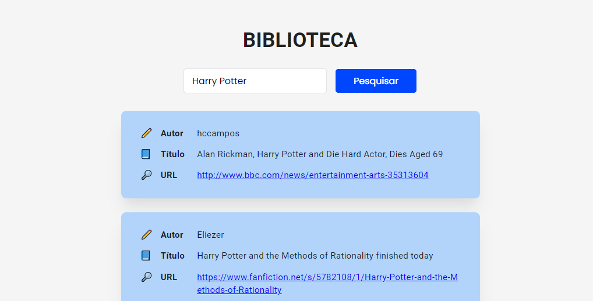

 <a href="#-descrição">Descrição</a> •
 <a href="#-layout">Layout</a> • 
 <a href="#-tecnologias">Tecnologias</a> • 
 <a href="#-autor">Autor</a> • 
 <a href="#-licença">Licença</a>

## 📝 Descrição

O projeto consiste em buscar informações de livros, a partir de uma chave de busca como entrada, e listá-los. Ao clicar no botão de pesquisar a aplicação mostrará o resultado dos livros relacionados enviados por uma (API)[https://hn.algolia.com/api/v1/search?query=] que está sendo consumida. Este trabalho foi produzido com o intuito de praticar os conhecimentos a cerca da linguagem **TypeScript** junto ao framework CSS **Material UI**.

## 🎨 Layout

    

## 🚀 Tecnologias

As seguintes ferramentas foram usadas na construção do projeto:

- **[TypeScript](https://www.typescriptlang.org/)**
- **[React.js](https://reactjs.org/)**
- **[Material UI](https://ejs.co/)**
- **[Axios](https://axios-http.com/)**

> Veja o arquivo [package.json](package.json)

## 🦸 Autor

Oi, me chamo **Douglas Morais**. Entre em contato comigo! 👇 

	<a href="https://linkedin.com/in/douglasmorais" target="_blank"> @douglasmorais</a>

	<a href="https://www.instagram.com/douglas_moraiis/" target="_blank"> @douglas_moraiis</a>

	<a href="https://twitter.com/JDouglas_Morais" target="_blank"> @JDouglas_Morais</a>

## 📝 Licença

Este projeto esta sobe a licença MIT.  
Veja o arquivo [LICENSE](.github/LICENSE) para mais detalhes.

Feito com 💙 por <a href="https://www.linkedin.com/in/douglasmorais">Douglas Morais</a>.
 
